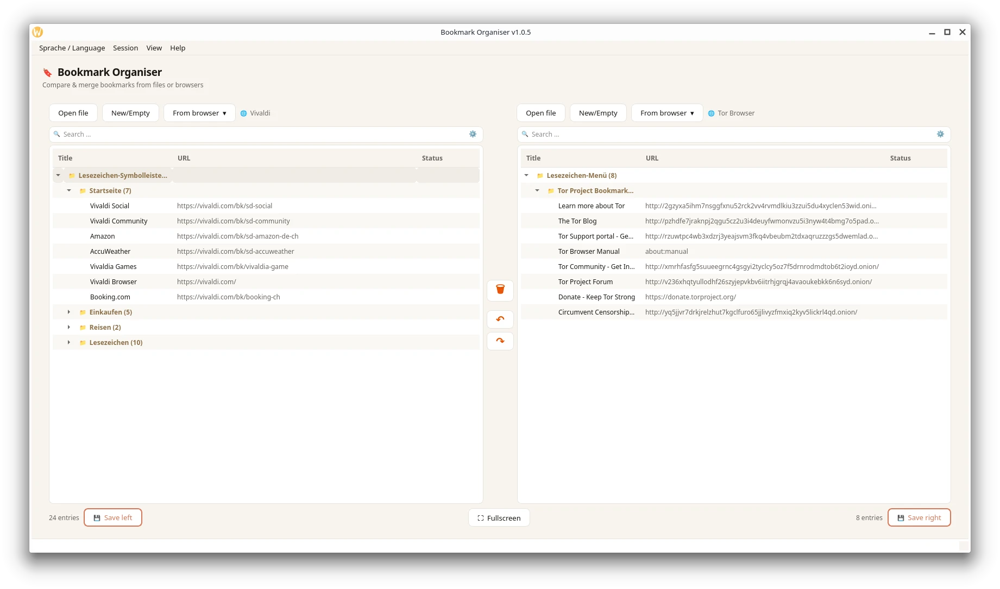
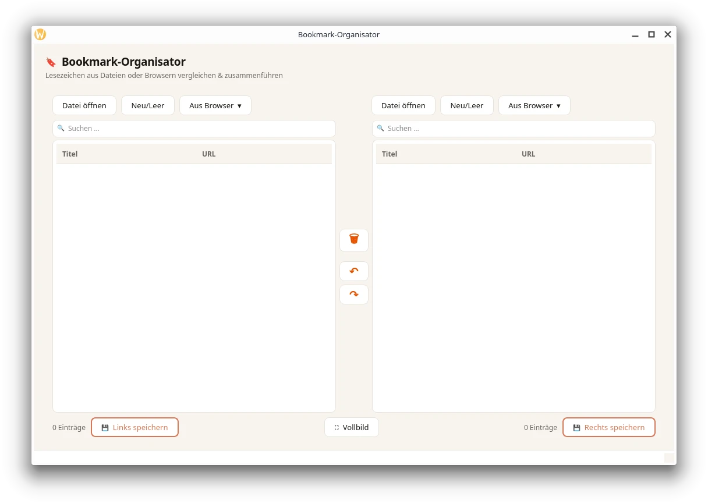

# 🔖 Bookmark-Organisator

Ein leichtgewichtiger Desktop-Lesezeichen-Manager für Linux, gebaut mit Python und PyQt6. Er ermöglicht das Vergleichen, Zusammenführen und Bearbeiten von Lesezeichen aus verschiedenen Browsern und Dateiformaten – alles in einer übersichtlichen Zwei-Panel-Ansicht.


---

## ✨ Funktionen

- **Zwei-Panel-Ansicht** – Zwei Lesezeichen-Sammlungen gleichzeitig anzeigen, vergleichen und bearbeiten
- **Browser-Import** – Lesezeichen direkt aus Firefox, Chromium/Chrome und anderen Browsern laden
- **Datei-Import** – Unterstützt HTML (Netscape-Format), JSON und CSV
- **Drag & Drop** – Lesezeichen und Ordner per Maus verschieben – innerhalb einer Seite oder zwischen links und rechts
- **Inline-Bearbeitung** – Titel und URL direkt im Baum per Doppelklick bearbeiten
- **Suche/Filter** – Echtzeitsuche in jeder Seite separat
- **Undo / Redo** – Unbegrenzte Rückgängig-Funktion (Strg+Z / Strg+Y)
- **Export** – Speichern als HTML (browser-kompatibles Netscape-Format), JSON oder CSV
- **Vollbild-Modus** – Maximierte Ansicht für konzentriertes Arbeiten
- **Speichern-Abfrage beim Beenden** – Verhindert ungewollten Datenverlust
- **Warmes Hell-Theme** – Angenehmes Cream-White/Orange-Design

---

## 📋 Voraussetzungen

- Python 3.10 oder neuer
- PyQt6

```bash
pip install PyQt6
```

Für den direkten Browser-Import wird außerdem Lesezugriff auf die Browser-Profildateien benötigt (z. B. `places.sqlite` für Firefox).

---

## 🚀 Installation & Start

```bash
# Repository klonen
git clone https://github.com/DEIN-BENUTZERNAME/bookmark-organisator.git
cd bookmark-organisator

# Abhängigkeiten installieren
pip install PyQt6

# Programm starten
python bookmark-organisator.py
```

---

## 🖱️ Bedienung

### Lesezeichen laden

| Schaltfläche | Funktion |
|---|---|
| **Datei öffnen** | HTML-, JSON- oder CSV-Datei importieren |
| **Neu / Leer** | Leere Seite anlegen und manuell befüllen |
| **Aus Browser ▾** | Direkt aus installiertem Browser importieren |

### Bearbeiten

- **Doppelklick** auf einen Eintrag → Titel oder URL direkt bearbeiten
- **Drag & Drop** → Einträge zwischen Ordnern oder zwischen den beiden Seiten verschieben
- **Rechtsklick** → Kontextmenü mit weiteren Optionen
- **🗑 (Mitte)** → Ausgewählte Einträge auf beiden Seiten gleichzeitig löschen

### Tastaturkürzel

| Kürzel | Funktion |
|---|---|
| `Strg + Z` | Rückgängig |
| `Strg + Y` | Wiederherstellen |

### Speichern & Export

- **💾 Links / Rechts speichern** → Lesezeichen als HTML, JSON oder CSV exportieren
- **HTML-Export** erzeugt das standard-kompatible Netscape-Bookmark-Format, das von allen gängigen Browsern importiert werden kann.

---

## 📁 Unterstützte Dateiformate

| Format | Importieren | Exportieren | Hinweis |
|---|---|---|---|
| HTML (`.html`) | ✅ | ✅ | Netscape-Bookmark-Format (Browser-Standard) |
| JSON (`.json`) | ✅ | ✅ | Eigenes Format mit `path`, `title`, `url` |
| CSV (`.csv`) | ✅ | ✅ | Spalten: `path`, `title`, `url` |

---

## 🗂️ Projektstruktur

```
bookmark-organisator/
├── bookmark-organisator.py   # Hauptdatei (komplette Anwendung)
└── README.md
```

---

## 🖼️ Screenshots

**Mit geladenen Lesezeichen (Vivaldi-Browser):**



**Startansicht (leer):**



---

## 🤝 Beitragen

Pull Requests und Issues sind willkommen. Bitte öffne zuerst ein Issue, um größere Änderungen zu besprechen.

---

## 📄 Lizenz

Dieses Projekt steht unter der [GNU General Public License v3.0](https://www.gnu.org/licenses/gpl-3.0.html).  
Du darfst den Code frei verwenden, verändern und weitergeben – unter der Bedingung, dass abgeleitete Werke ebenfalls unter der GPL veröffentlicht werden.

---

## 👤 Autor

Entwickelt von **Juerg Rechsteiner** – [computer-experte.ch](https://www.computer-experte.ch)  
Linux Coach in der Region St. Gallen / Thurgau, Schweiz.
